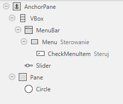

# Zadanie 5 - `Socket`y
##### Część 2 - Sterowanie kółkiem w aplikacji *JavaFX*

## CASE

### Sterowanie wielkością koła

###### Zadanie wstępne nie będzie oceniane, nie trzeba go odsyłać.

Wykonaj aplikację *JavaFX* rysującą na `panel`u kółko. Na górze jest `menu` i suwak.

Kółko dopasowane jest do wielkości `panel`u (średnica jest minimum z szerokości i wysokości, 
środek na środku `panel`u).

Zmiana wielkości okna zmienia proporcjonalnie kółko.

W `menu` Sterowanie jest element typu `Check` *Steruj*.

Włączenie tego elementu powoduje, że suwak będzie sterował wielkością koła.

`100` na suwaku będzie oznaczało, że wielkość koła to 100% wolnej przestrzeni na `panel`u. 
Ponowne kliknięcie `menu` odłączy suwak od sterowania kołem.

#### Etapy wykonania

1. Przygotuj nową aplikację *JavaFX* z `FXML`.
2. Przygotuj makietę. Układ elementów może być jak na zdjęciu powyżej.
   Element `VBox` jest "przylepiony" do górnej części `Anchor` i zawiera `menu` oraz `slider`.
   `Pane` jest przyłączony do wszystkich czterech ścian `Anchor`. Koło można wstawić w dowolnym
   miejscu `Pane`.
3. W makiecie dodaj następujące zmienne i funkcje obsługi:
   * dodaj zmienną dla `slider`a,
   * dodaj zmienną dla `CheckMenuItem`,
   * dodaj zmienna do `Pane`,
   * dodaj zmienną do `Circle`,
   * dodaj funkcję obsługi kliknięcia `CheckMenuItem`.

   Po zapisaniu `FXML` wygeneruj `Controller`.
4. Ustawiamy koło na środku. Operacje wykonujemy w funkcji `initialize`.
   * przygotuj obiekt `ChangeListener` (może się nazywać `paneSizeListener`), który będzie odczytywał szerokość 
     i wysokość `Pane`. Połowa każdej z tych wartości to środek `panel`u, a mniejsza z tych połówek to promień koła;
     `Listener` powinien ustawiać koło w odpowiednim miejscu,
   * podłącz `paneSizeListener` pod `widthProperty` i `heightProperty` dla `Pane`;\
     zobacz podpowiedź https://stackoverflow.com/questions/38216268/how-to-listen-resize-event-of-stage-in-javafx,
   * testujemy.
5. Podłączamy `slider` pod sterowanie kołem:
   * w klasie kontrolera przygotuj zmienną typu `DoubleProperty` (może się nazywać value), której 
     ustawisz wartość `100`,
   * w funkcji `paneSizeListener`a, którą projektowałeś powyżej pomnóż wartość promienia koła przez `value/100`,
   * podłącz `paneSizeListener` pod value,
   * utwórz `ChangeListener`, który będzie zmieniał wartość value. Możesz go nazwać `sliderListener`,
   * podłącz `slider.valueProperty()` pod powyższy `listener`,
   * testujemy.
6. Obsługa `menu`:
   * w funkcji obsługi `menu` sprawdź, czy element `menu` jest zaznaczony czy nie,
   * jeśli jest zaznaczony podłącz `slider.valueProperty()` pod `sliderListener`,
   * jeśli nie jest zaznaczony — odłącz `slider.valueProperty()` od `sliderListener`a,
   * testujemy.

## Zadanie Laboratoryjne

### Polecenie 1 (1 pkt)

Będziemy pracować na bazie aplikacji wykonanej w poprzednim ćwiczeniu. 
Aplikację nazwij **Kółko-Klient**.

Obok `menu` *Sterowanie* robimy `menu` *Połączenie z serwerem* z elementem *Połącz*.

Do `layout`u dorzuć `Label`, który będzie miał początkowy tekst *Klient nie podłączony*.

Zakładamy, że sterowanie suwakiem będzie podłączone przez cały czas do kółka.

Użyj `Listener`ów i `Properties` tak, jak w poleceniu wstępnym.

### Polecenie 2 (0.5 pkt)

Wykonaj aplikację **Serwer**, która będzie wyglądać bardzo podobnie, z tym że nie będzie 
na niej suwaka.

Menu będzie miało nazwę **Serwer**, a w środku będzie pozycja *Uruchom*.

`statusLabel` ma początkowy tekst *Serwer nie działa*.

### Polecenie 3 - implementacja serwera (1 pkt)

#### Serwer musi używać `socket`ów `TCP`

Część sieciowa serwera musi być uruchomiona w wątku. Bez tego nie będziemy mogli:
* zatrzymać serwera,
* odświeżać widoku z kółkiem (nie będzie reagować na przysyłaną wartość promienia).

#### Kliknięcie elementu `menu` *Uruchom* spowoduje, że serwer utworzy gniazdo serwerowe

Następnie powinien uruchomić wątek z pętlą nieskończoną, która będzie:
* zmieniała `Menu` na *Zatrzymaj* oraz status na *Serwer działa*,
* uruchamiała funkcję `accept()`, która czeka na podłączenie klienta,
* jeśli `accept` przyjmie połączenie (otwieramy strumień wejściowy), to zmieniamy status na 
  *Klient podłączony* i uruchamiamy wewnętrzną pętlę nieskończoną, która:
  * czeka na dane od klienta,
  * aktualizuje rozmiar koła.

#### Wyjście z pętli wewnętrznej
Poprzez wyjątek związany z zamknięciem strumienia. Dodatkowo aktualizujemy status
na *Serwer działa*.

#### Wyjście z pętli zewnętrznej
Poprzez wyjątek związany z zamknięciem `socket`u. Obsługa wątku aktualizuje status
na *Serwer nie działa* oraz `menu` na *Uruchom*.

Serwer zatrzymamy poprzez wydanie polecenia zamknięcia strumienia (jeśli był otwarty) i `socket`ów.
Spowoduje to wystąpienie wyjątku w pętli wątku i zakończenie wątku.

**Uwaga**: serwer musi być odporny na "kompromitację". Błedy transmisji, zamknięcie klienta, 
próba uruchomienia drugiego klienta itp muszą być obsłużonymi wyjątkami. Program nie może się 
zakończyć lub "sypać wyjątkami". Wystąpienie wyjątków powinno zamykać połączenia i powodować 
gotowość serwera do przyjęcia kolejnego połączenia.

### Polecenie 4 - implementacja klienta (0.5 pkt)
Aplikacja klienta powinna działać z wykorzystaniem wątków, aby zapewnić płynność działania *GUI*
podczas transmisji danych

#### Łączenie z serwerem
* Kliknięcie *Połącz* powinno w bloku `try/catch` uruchomić gniazdo i otworzyć strumień wyjściowy.
* Jeśli operacja się powiedzie, zmieniamy element `menu` na "Rozłącz* oraz status
  na *Klient połączony".
* Jeśli operacja rzuci wyjątek, zmieniamy element `menu` na *Połącz* oraz status 
  na *Klient nie połączony*. `Socket` i strumień zamykamy.
* Następne zmiany poczynimy w funkcji nasłuchu `Slider`a.

#### Wysyłanie danych

Aktualną wartość `slider`a należy zapisać do strumienia wyjściowego, o ile jest on otwarty.

#### Rozłączanie

Po kliknięciu *Rozłącz* należy zamknąć strumień i `socket` o ile są otwarte.
Zmieniamy element `menu` na *Połącz* oraz status na *Klient nie połączony*. 
`Socket` i strumień zamykamy.

**Uwaga**: podobnie jak serwer, klient powinien być odporny na błędy, w tym zamknięcie serwera.
Po wystąpieniu błędu sieciowego klient powinien uzyskać status *klient nie podłączony* 
i reagować na polecenia użytkownika.

